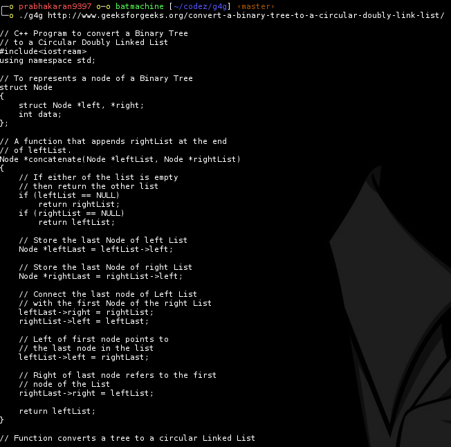
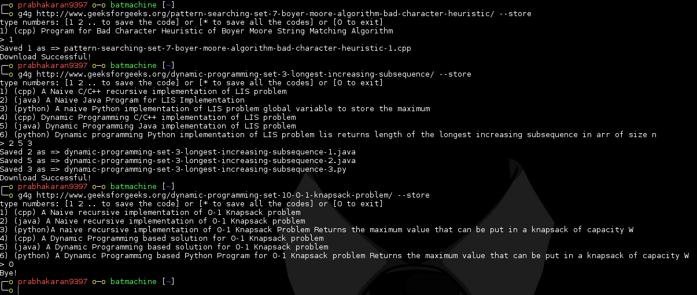

# GeeksforGeeks Code Puller
Pull the code from GeeksorGeeks to command line

## Preinstallations

$ `sudo apt -y install python-pip`

$ `sudo pip install BeautifulSoup4`

## Installing

To download this repository, you may either clone via git:

$ `cd ~`

$ `git clone https://github.com/lost-plus-found/geeksforgeeks.git`

or download a source code: [GeeksforGeeks-Code-Puller](https://github.com/lost-plus-found/geeksforgeeks/archive/master.zip).

$ `cd ~/geeksforgeeks`

$ `sudo make install`

## Updating

###### Please make sure you don't have any downloaded code in geeksforgeeks folder before updating

$ `cd ~/geeksforgeeks`

$ `sudo make update`

## Uninstalling

$ `cd ~/geeksforgeeks`

$ `sudo make uninstall`

### Running the command

##### To view all the codes in that page

$ `g4g <geeksforgeeks link>`

##### To store all the codes in that page

$ `g4g <geeksforgeeks link> --store`

